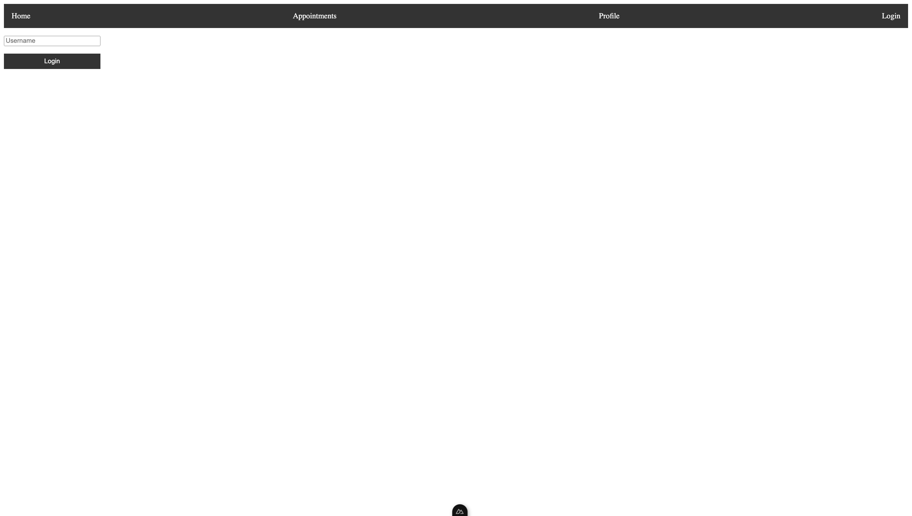
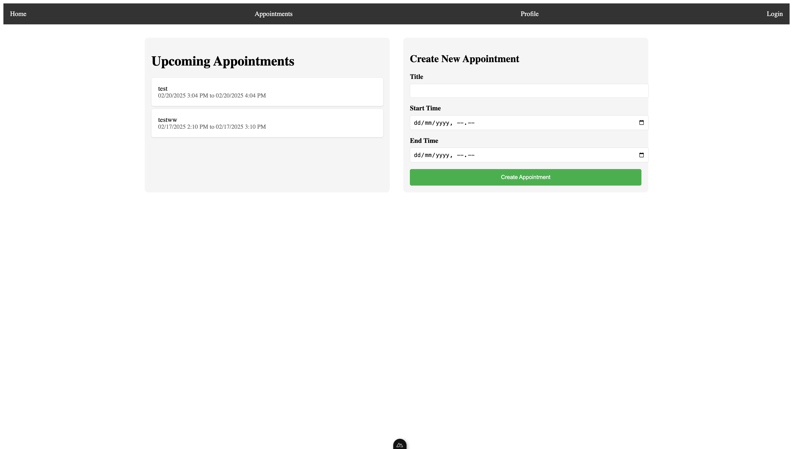
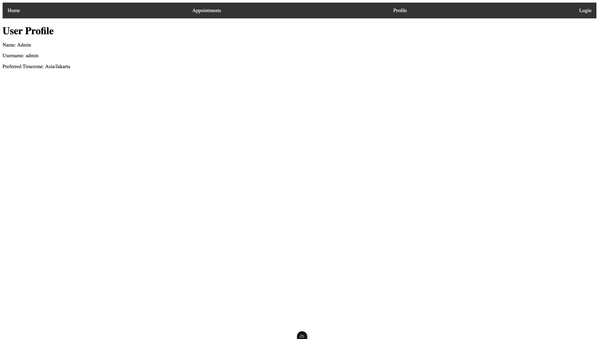

# Appointment System

## Description
A web-based appointment system for managing and scheduling appointments.

## Prerequisites
- Golang (v1.16 or higher)
- Node.js (v14 or higher)
- npm or yarn
- Git


## Screenshots




## Installation

1. Clone the repository
```bash
git clone https://github.com/rfaturriza/appointment-system.git
cd appointment-system
```

2. Install dependencies
```bash
make install
```

3. Configure environment variables
```bash
cd backend
cp .env.example .env
```
Edit the `.env` file with your configuration settings.

## Running the Application

### Development mode
```bash
make run-all
```

### Production build
```bash
make backend-build
make frontend-build
```

## Features
- User authentication
- Appointment scheduling

## Contributing
1. Fork the repository
2. Create your feature branch (`git checkout -b feature/amazing-feature`)
3. Commit your changes (`git commit -m 'Add some amazing feature'`)
4. Push to the branch (`git push origin feature/amazing-feature`)
5. Open a Pull Request

## License
This project is licensed under the MIT License - see the [LICENSE](LICENSE) file for details.